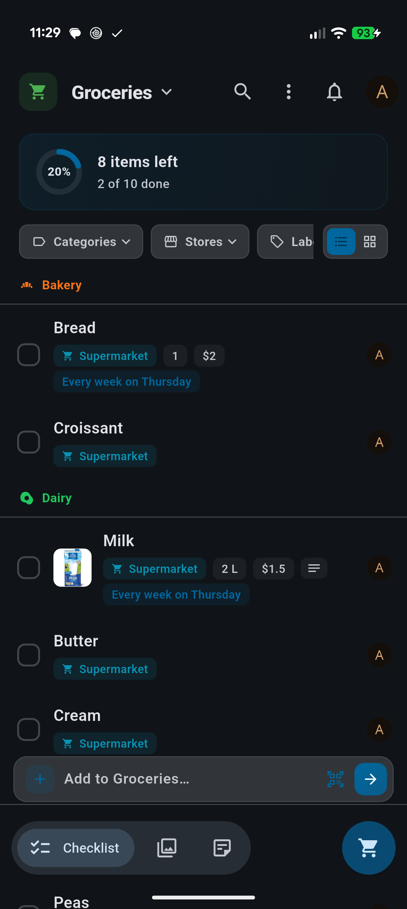
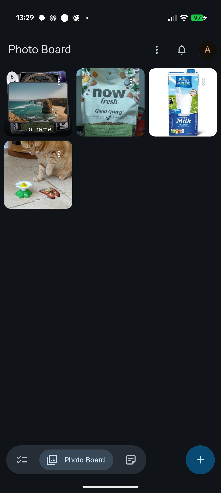
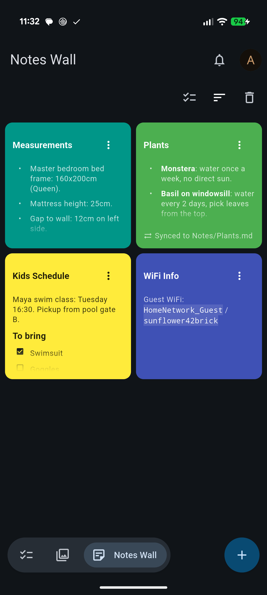
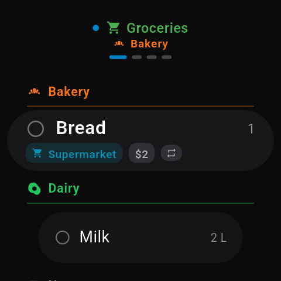
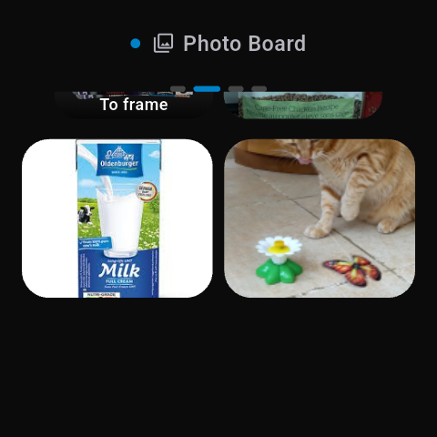
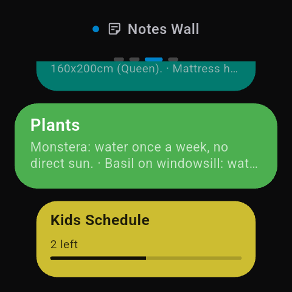

# Pantry

[](https://discord.gg/6MvhMh4Jk)

A Flutter client for [Nextcloud Pantry](https://github.com/chenasraf/nextcloud-pantry) — household
management for your self-hosted Nextcloud, on your phone, your desktop, and your Wear OS watch.

**Website & documentation: [pantry.casraf.dev](https://pantry.casraf.dev)** — including a
[guide to pairing the app](https://pantry.casraf.dev/docs/getting-started/pairing) with your server.

## Features

- **Checklists**: Shared checklists with categories, quantities, images, and recurring items.
- **Photo Board**: Upload and organize shared photos in folders with captions.
- **Notes Wall**: Color-coded shared notes for household reminders.
- **Wear OS**: A watch app with your checklists, photo board, notes, and shopping trips, plus a tile
  for your lists and a live trip on the watch face.
- **Drag-and-drop reordering** everywhere.
- **Multi-select** for bulk actions.
- **Offline caching** for fast loading.
- **Material Design 3** with dark mode.
- **Self-hosted** — connects directly to your own Nextcloud server via Login Flow v2.

|                                                                                    |                                                                                     |                                                                                    |
| ---------------------------------------------------------------------------------- | ----------------------------------------------------------------------------------- | ---------------------------------------------------------------------------------- |
|  |  |  |
|  |  |  |

## Requirements

A Nextcloud server with the [Pantry server app](https://github.com/chenasraf/nextcloud-pantry)
installed.

If you have issues regarding the core app for Nextcloud, please open the issue on the repo linked
above. This repository is specifically for the companion mobile/desktop apps.

## Installation

### Google Play & F-Droid

- [Install from Google Play](https://play.google.com/store/apps/details?id=dev.casraf.pantry)
- [Install from F-Droid](https://f-droid.org/en/packages/dev.casraf.pantry/)

### Wear OS

[Install from Google Play](https://play.google.com/store/apps/details?id=dev.casraf.pantry) on the
watch — it is the same listing as the phone app, so Play offers it there once the phone app is
installed. Alternatively, sideload `pantry-<version>-wear-<abi>.apk` from the
[latest release](https://github.com/chenasraf/pantry-flutter/releases/latest) — most watches take
`armeabi-v7a`.

The watch starts the pairing. Open Pantry on it and tap **Open on phone**: the phone app comes up
with the request, and allowing it signs the watch in — nothing is typed on the watch. **Sign in with
QR** on the same screen is the alternative, drawing a code you scan with any phone's camera, which
needs no phone app at all. The F-Droid build has no watch pairing, since the transport it needs is
proprietary — use the QR path there.

### Beta testing

Want early access to new features? Join the beta program:

1. Visit the [beta opt-in page](https://play.google.com/apps/testing/dev.casraf.pantry) on your
   Android device.
2. Tap **Become a tester**.
3. Install or update Pantry from the
   [Play Store listing](https://play.google.com/store/apps/details?id=dev.casraf.pantry) — you'll
   automatically receive beta builds.

It may take a few minutes for your tester status to propagate.

### Manual (APK)

Download the latest APK from the
[latest release](https://github.com/chenasraf/pantry-flutter/releases/latest) and sideload onto your device.

### App Store (iOS/macOS)

[Install from the App Store](https://apps.apple.com/us/app/pantry-for-nextcloud/id6762161619)

### Linux

Download `pantry-<version>-linux-x64.tar.gz` from the
[latest release](https://github.com/chenasraf/pantry-flutter/releases/latest), then extract and run it:

```bash
tar -xzf pantry-<version>-linux-x64.tar.gz -C ~/pantry
~/pantry/pantry
```

The bundle requires the GTK 3 and libsecret runtime libraries, which are already present on most
desktop distributions (`libgtk-3-0` and `libsecret-1-0` if you need to install them manually).

### Windows

Download `pantry-<version>-windows-x64.zip` from the
[latest release](https://github.com/chenasraf/pantry-flutter/releases/latest), extract it anywhere, and run
`pantry.exe`. The build is unsigned, so Windows SmartScreen may warn on first launch — choose **More
info → Run anyway**.

## Development

Setup, workflow, project layout, the i18n guide, and coding/commit conventions live in
**[DEVELOPMENT.md](DEVELOPMENT.md)**. Quick start:

```bash
make get            # install dependencies
make install-hooks  # install git hooks
make i18n           # generate i18n code
make run            # run in debug mode
```

Translations are very welcome — see the [i18n guide](DEVELOPMENT.md#internationalization-i18n).

## Privacy

Pantry is a self-hosted client. Your data never leaves your Nextcloud server. See the
[privacy policy](https://casraf.dev/pantry-privacy-policy) for details.

## Contributing

I am developing this app on my free time, so any support, whether code, issues, or just stars is
very helpful to sustaining its life. If you are feeling incredibly generous and would like to donate
just a small amount to help sustain this project, I would be very very thankful!

<a href='https://ko-fi.com/casraf' target='_blank'>
  
</a>

I welcome any issues or pull requests on GitHub. If you find a bug, or would like a new feature,
don't hesitate to open an appropriate issue and I will do my best to reply promptly.

Ready to hack on it? See **[DEVELOPMENT.md](DEVELOPMENT.md)** for the dev setup, workflow, and
contribution guide.

## License

This app is licensed under the [MIT](LICENSE) license.
